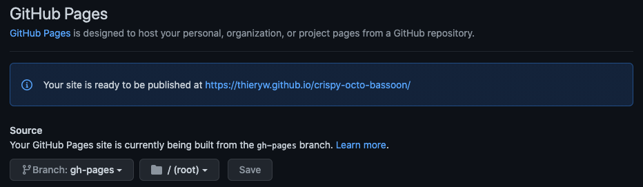
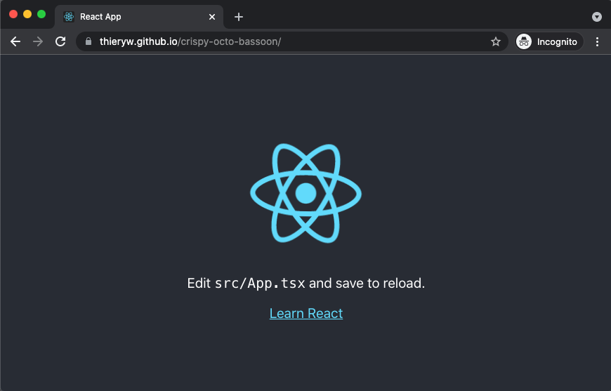

# 🏃♂ Getting started!

### Overview

Let's start with an overview of what we are trying to achieve.

Let's check how [the landingpage of GitLangind itself](https://www.gitlanding.dev/) is setup.

The code of the website lies on a [dedicated branch](https://github.com/thieryw/gitlanding/tree/4e5a33ed312227efcf7d26332ea87c19331f1eed) of the [GitLanding repo](https://github.com/thieryw/gitlanding/tree/2105d99c84b76f6c6b0647484171c5e09a61dbf5). The files that are actualy served by [GitHub Page](https://pages.github.com/) lies on the [`gh_page`](https://github.com/thieryw/gitlanding/tree/b11d5dab0df08a84b7acc72a25d0c3fa7c78cc6b) branch and is put there using [this GitHub Action](https://github.com/thieryw/gitlanding/blob/eb85ca1fea7ce0ce21837d1e0ba7a6bb1a784b19/.github/workflows/deploy.yml#L21).



### Step by step guide



Open a new terminal (for example [iTerm2](https://iterm2.com) )

```bash
# Only if you don't have yarn already 
# (you need https://brew.sh to run the next command)
brew install yarn

#
git clone https://github.com/<user_name>/<project_name> <project_name>_landingpage 
cd <project_name>_landingpage

git checkout --orphan landingpage && git rm -rf .
yarn create react-app . --scripts-version 4.0.3 --template typescript
mkdir -p .github/workflows
wget gitlanding.dev/deploy.yaml -O .github/workflows/deploy.yaml
# Don't get frightened by the next command.
# It will just update the "homepage" field with: 
# https://<your_github_username>.github.io/<your_repo_name> 
# in the package.json.
# Feel free to do that manually.
node -e '(()=>{require("fs").writeFileSync("package.json",JSON.stringify({...require("./package.json"),"homepage": (() => {const [r, u] = `${require("child_process").execSync("git remote get-url origin")}`.replace(/\n/g, "").replace(".git", "").replace(/:/g, "/").replace(/\r?\n$/, "").split("/").reverse();return `https://${u}.github.io/${r}`;})()}, null, 2));})()'
git add -A
git commit -m "Initial commit"
git push --set-upstream origin landingpage
```



If you don't have it already, [install Node.js](https://nodejs.org/en/).

Open a Powershell terminal

```bash
git clone https://github.com/<user_name>/<project_name> <project_name>_landingpage 
cd <project_name>_landingpage

git checkout --orphan landingpage
git rm -rf .
yarn create react-app . --scripts-version 4.0.3 --template typescript
mkdir .github\workflows
curl gitlanding.dev/deploy.yaml -O .github/workflows/deploy.yaml
# Don't get frightened by the next command.
# It will just update the "homepage" field with: 
# https://<your_github_username>.github.io/<your_repo_name> 
# in the package.json.
# Feel free to do that manually.
node -e "(()=>{require('fs').writeFileSync('package.json',JSON.stringify({...require('./package.json'),'homepage': (() => {const [r, u] = ('' + require('child_process').execSync('git remote get-url origin')).replace(/\n/g, '').replace('.git', '').replace(/:/g, '/').replace(/\r?\n$/, '').split('/').reverse();return 'https://' + u + '.github.io/' + r;})()}, null, 2));})()"
git add -A
git commit -m "Initial commit"
git push --set-upstream origin landingpage
```



If you don't have [the yarn package manager](https://classic.yarnpkg.com/lang/en/) installed allready:

```bash
# Using Ubuntu
sudo su
curl -fsSL https://deb.nodesource.com/setup_16.x | sudo -E bash -
# Using Debian
su root
curl -fsSL https://deb.nodesource.com/setup_16.x | bash -
####
apt-get install -y nodejs
npm install -g yarn
```

Open a new terminal

```bash
git clone https://github.com/<user_name>/<project_name> <project_name>_landingpage  
cd <project_name>_landingpage

git checkout --orphan landingpage && git rm -rf .
# If you get: 'yarn: error: no such option: --template' running the following command. It means you have 'yarn' from cmdtest, we need yarn the package manager.
yarn create react-app . --scripts-version 4.0.3 --template typescript
mkdir -p .github/workflows
wget gitlanding.dev/deploy.yaml -O .github/workflows/deploy.yaml
# Don't get frightened by the next command.
# It will just update the "homepage" field with: 
# https://<your_github_username>.github.io/<your_repo_name> 
# in the package.json.
# Feel free to do that manually.
node -e '(()=>{require("fs").writeFileSync("package.json",JSON.stringify({...require("./package.json"),"homepage": (() => {const [r, u] = `${require("child_process").execSync("git remote get-url origin")}`.replace(/\n/g, "").replace(".git", "").replace(/:/g, "/").replace(/\r?\n$/, "").split("/").reverse();return `https://${u}.github.io/${r}`;})()}, null, 2));})()'
git add -A
git commit -m "Initial commit"
git push --set-upstream origin landingpage
```



Next you'll have to enable GitHub page in your repo. Navigate to your repository on Github and go to `Setting > Pages`, then set the `gh-pages` branch as the branch from witch the site is to be built.


You may need to wait a few minutes for the initial gh-pages branche to be created by your GitHub Action workflow `.github/workflows/deploy.yaml`




If all went as expected you page should be up and running



You're now ready to start customizing this page with `Gitlanding`.
