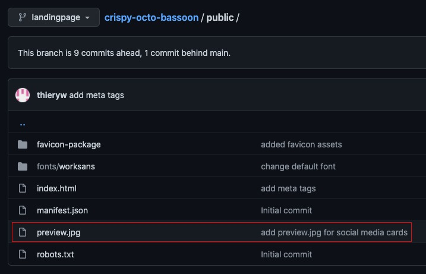

# Getting started


Before getting started you might want to checkout a repo whith a gitlanding page setup. For example [the landingpage of GitLangind itself](https://www.gitlanding.dev).

The code of the website lies on a [dedicated branch](https://github.com/thieryw/gitlanding/tree/4e5a33ed312227efcf7d26332ea87c19331f1eed) of the [GitLanding repo](https://github.com/thieryw/gitlanding/tree/2105d99c84b76f6c6b0647484171c5e09a61dbf5). The file that are actally served by [GitHub Page](https://pages.github.com) lies on the [`gh_page`](https://github.com/thieryw/gitlanding/tree/b11d5dab0df08a84b7acc72a25d0c3fa7c78cc6b) branch and is put there using [this GitHub Action](https://github.com/thieryw/gitlanding/blob/eb85ca1fea7ce0ce21837d1e0ba7a6bb1a784b19/.github/workflows/deploy.yml#L21).


```bash
# first cd in your project

git checkout --orphan landingpage && git rm -rf .
yarn create react-app . --template typescript
mkdir -p .github/workflows
wget gitlanding.dev/deploy.yaml -O .github/workflows/deploy.yaml
# This next command will set the homepage to 
# "https://USERNAME.github.io/REPO" in your package.json
node -e 'require("fs").writeFileSync("package.json",JSON.stringify({...require("./package.json"), "homepage": (()=>{ const [r, u]= `${require("child_process").execSync("git remote get-url origin")}`.replace(/\r?\n$/, "").split("/").reverse(); return `https://${u}.github.io/${r}`; })()},null,2))'
git add -A
git commit -m "Initial commit"
git push --set-upstream origin landingpage
```

Next you'll have to enable GitHub page in your repo.  It's in your repo GitHub page > _settings > pages_ .


You may need to wait a few minutes for the initial gh-pages branche to be created by your GitHub Action workflow `.github/workflows/deploy.yaml`



If all went as expected you page should be up and running



Later on, you will probably want to use your own domain name. For that, you'll have to.

1. [Configure the DNS](https://user-images.githubusercontent.com/39378411/135731113-660804da-060d-4c60-b4d5-8b944fe00a5d.png)
2. [Remove the `hostname` file from your `package.json`](https://github.com/thieryw/crispy-octo-bassoon/blob/431679969c454772605d2d16ad69290559a43cba/package.json#L39)``
3. [Create a `CNAME` file in your `public/` directory](https://github.com/thieryw/gitlanding/blob/landingpage/public/CNAME)
4. [Update your GitHub Pages configuration](https://user-images.githubusercontent.com/39378411/135731497-b1f0bb1b-413d-4aae-bc8e-6d77174aae41.png)



For changing the favicon (the little logo in your browser tab)

1. Navigate to [realfavicongenerator.net](https://realfavicongenerator.net) and upload your image.
2. In the option set a [custom path](https://user-images.githubusercontent.com/6702424/137597391-1d0d5b26-0f5b-4d8d-8d29-46d874c4f4e0.png): `%PUBLIC_URL%/favicon`
3. Insert [the code generated for you](https://user-images.githubusercontent.com/6702424/137597436-4f85641e-16a3-4cb9-8c4f-5fd4baf8effc.png) in the `<head>` of your `public/index.html` file
4. Create the `public/favicon directory and extract the zip file there.`


You're now ready to start customizing this page with `Gitlanding`.

## Adding Meta Tags


Put a preview image at the root of your public directory for the social media cards.




Now add the `meta tags` in the `head` of your `index.html` file. [Checkout  this commit for our example.](https://github.com/thieryw/crispy-octo-bassoon/commit/143c6ac0a920896c4493b9ef6ab8233f0c7db95b)

