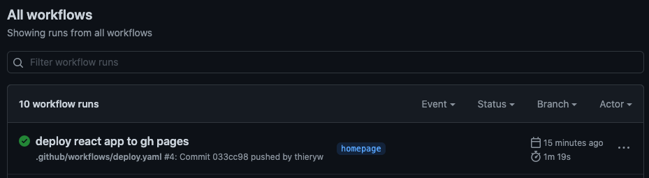
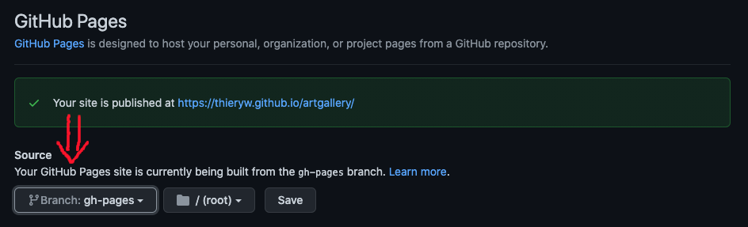

# Getting started

## A concrete setup example

Before getting started you might want to checkout a repo whith a gitlanding page setup. For example [the landingpage of GitLangind itself](https://www.gitlanding.dev).

The code of the website lies on a [dedicated branch](https://github.com/thieryw/gitlanding/tree/landingpage) of the [GitLanding repo](https://github.com/thieryw/gitlanding). The file that are actally served by [GitHub Page](https://pages.github.com/) lies on the [`gh_page`](https://github.com/thieryw/gitlanding/tree/gh-pages) branch and is put there using [this GitHub Action](https://github.com/thieryw/gitlanding/blob/335fb7d73e1b6458d897ccc1fe5a87ed618b7026/.github/workflows/deploy-on-gh-pages.yml#L21).

## Step-by-step guide

Let's see how to setup a landing page for a repo of your choosing. \`

### **Create a new empty branch on the repository you want to showcase.**

```bash
# first cd in your project

git checkout --orphan landingpage && git rm -rf .
yarn create react-app . --template typescript
mkdir -p .github/workflows
wget https://www.gitlanding.dev/deploy.yaml -O .github/workflows/deploy.yaml
# This next command will set the homepage to 
# "https://USERNAME.github.io/REPO" in your package.json
node -e 'require("fs").writeFileSync("package.json",JSON.stringify({...require("./package.json"), "homepage": (()=>{ const [r, u]= `${require("child_process").execSync("git remote get-url origin")}`.replace(/\r?\n$/, "").split("/").reverse(); return `https://${u}.github.io/${r}`; })()},null,2))'
git add -A
git commit -m "Initial commit"
```

### \*\*\*\*

You can check that the github actions have been completed by going to the actions tab in your github repository: `https://github.com/YOUR-USER-NAME/YOUR-REPO-NAME/actions/.`

This is what you should see:



### **Finally for the deployment to be complete**

Go to the pages tab in the settings of your repository: `https://github.com/YOUR-GITHUB-USER-NAME/YOUR-REPO-NAME/settings/pages` and under `source`, set the branch to `gh-pages`



Now that your site is published you can start making your landing page:

```bash
yarn add gitlanding
```


