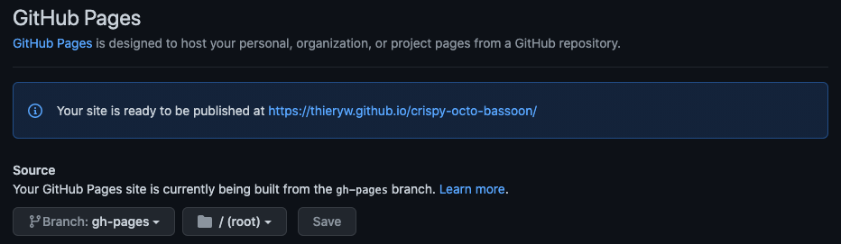

# Getting started


Before getting started you might want to checkout a repo whith a gitlanding page setup. For example [the landingpage of GitLangind itself](https://www.gitlanding.dev/).

The code of the website lies on a [dedicated branch](https://github.com/thieryw/gitlanding/tree/landingpage) of the [GitLanding repo](https://github.com/thieryw/gitlanding). The file that are actally served by [GitHub Page](https://pages.github.com/) lies on the [`gh_page`](https://github.com/thieryw/gitlanding/tree/gh-pages) branch and is put there using [this GitHub Action](https://github.com/thieryw/gitlanding/blob/eb85ca1fea7ce0ce21837d1e0ba7a6bb1a784b19/.github/workflows/deploy.yml#L21).


```bash
# first cd in your project

git checkout --orphan landingpage && git rm -rf .
yarn create react-app . --template typescript
mkdir -p .github/workflows
wget gitlanding.dev/deploy.yaml -O .github/workflows/deploy.yaml
# This next command will set the homepage to 
# "https://USERNAME.github.io/REPO" in your package.json
node -e 'require("fs").writeFileSync("package.json",JSON.stringify({...require("./package.json"), "homepage": (()=>{ const [r, u]= `${require("child_process").execSync("git remote get-url origin")}`.replace(/\r?\n$/, "").split("/").reverse(); return `https://${u}.github.io/${r}`; })()},null,2))'
git add -A
git commit -m "Initial commit"
git push --set-upstream origin landingpage
```

Next you'll have to enable GitHub page in your repo.  It's in _settings &gt; pages_ .


You may need to wait a few minutes for the initial gh-pages branche to be created by your GitHub Action workflow .github/workflows/deploy.yaml




If all went as expected you page should be up and running


Your now ready to start customizing this page with `GitLanding`

